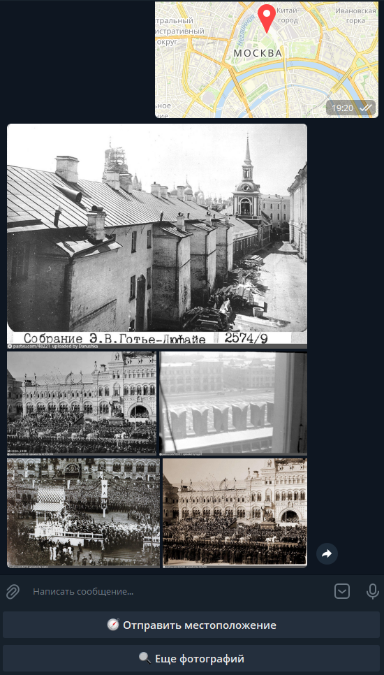
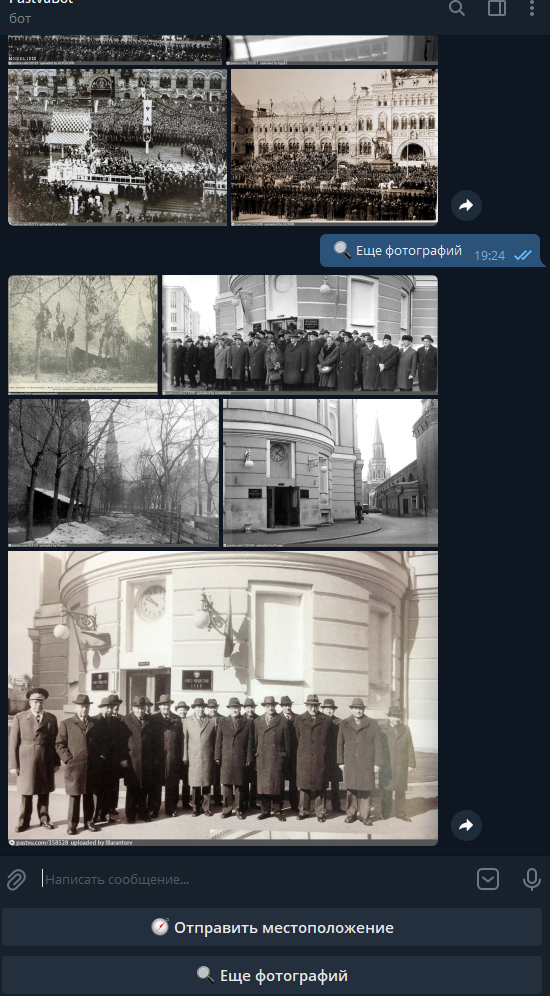

  
   
  <h1>PastvuBot</h1>
  <h3>Телеграм бот, который присылает исторические фотографии с сайта pastvu.com.
  </h3>
  
Отправьте свое местоположение, и получите результат. Есть возможность настроть период для поиска.

  

    
  

