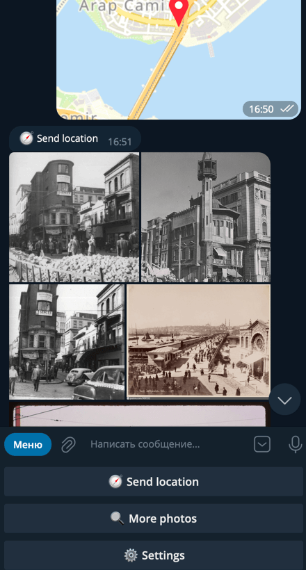

  
   
  <h1>PastvuBot</h1>
  <h3>Telegram bot that sends historical photos from pastvu.com.
  </h3>
  
Send me your location or link Google Maps and I will send historical photos that were taken in that location. You can set a specific period for photos in the settings.

  

    
  

